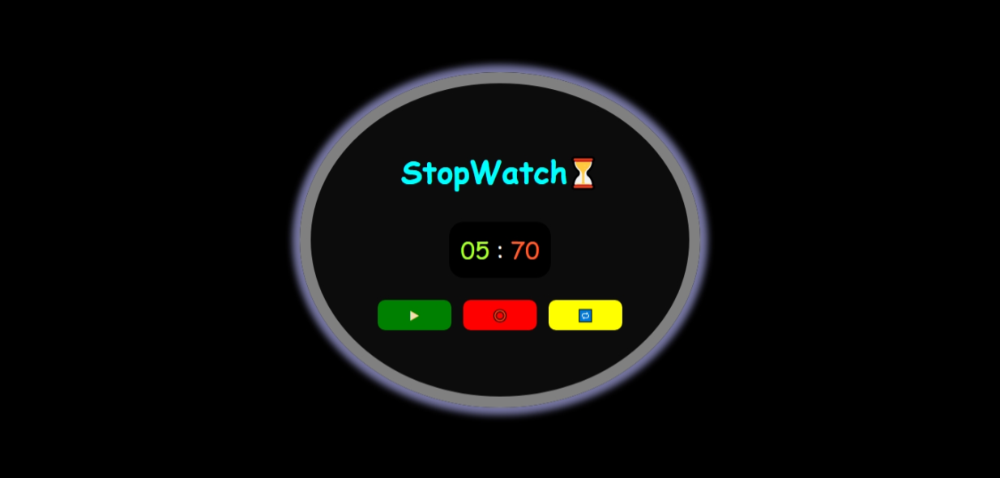

# Stopwatch ⏳

A simple JavaScript stopwatch with start, stop, and reset functionality, styled using HTML and CSS.

## 🔗 Live Demo

[Click here to view the live project](https://msdhinesh45.github.io/stop-watch)

## 📸 Screenshots

### Start View

### Running Timer View

## 🛠️ Features

- Start, stop, and reset the timer.
- Displays time in seconds and milliseconds.
- Clean and responsive UI.

## 📁 Files

- `index.html` – Main structure of the stopwatch.
- `styles.css` – Styling of stopwatch interface.
- `script.js` – Timer logic using `setInterval`.

## 💡 How It Works

The stopwatch updates milliseconds every 10ms using `setInterval`, and increments the second counter once it reaches 100 (since 10ms × 100 = 1s).

## ✅ Requirements

- web browser and Internet connection.

## 👨‍💻 Author

**Dhinesh Kumar**
